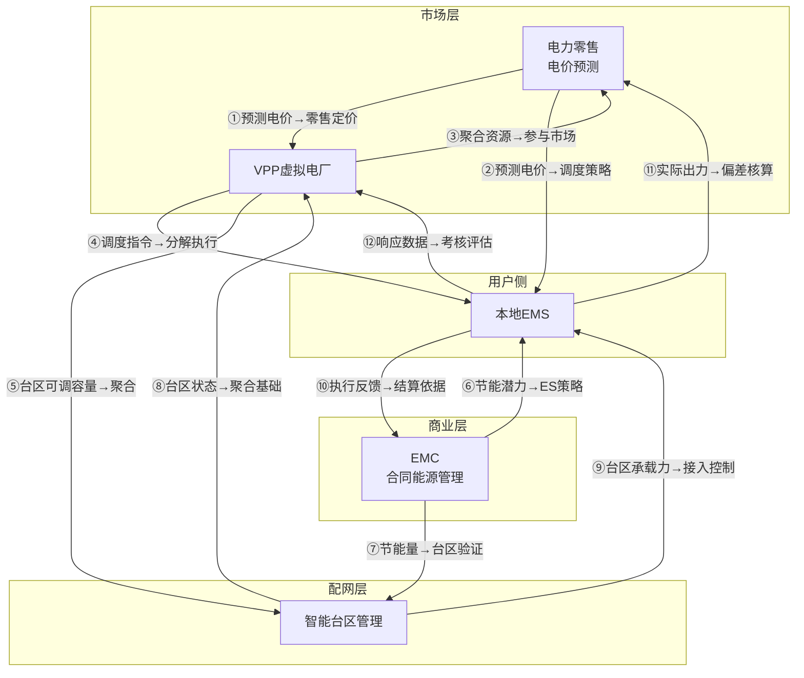

# 六域能力地图：电力零售 + VPP + EMC + 智能台区 + 本地EMS

> 绘制日期：2026-05-20
> 版本：v1.0
> 覆盖范围：电力零售（电价预测）、虚拟电厂（VPP）、合同能源管理（EMC）、智能台区管理、本地能量管理系统（EMS）

---

## 一、分层架构总览

```
┌──────────────────────────────────────────────────────────────────────────────┐
│                             市场层（Market Layer）                            │
│  ┌────────────────────────────┐   ┌──────────────────────────────────────┐   │
│  │  电力零售（电价预测+售电）   │◄──│  VPP 虚拟电厂（资源聚合+市场交易）    │   │
│  │  · 现货电价预测             │   │  · 分布式资源聚合                   │   │
│  │  · 用户负荷预测             │   │  · 电力市场交易（现货/辅助服务/DR）  │   │
│  │  · 零售套餐定价             │   │  · 可调容量评估                     │   │
│  │  · 偏差电量管理             │   │  · 调度指令分解                     │   │
│  │  · 客户用能分析             │   │  · VPP运行监控与考核                │   │
│  └────────┬───────────────────┘   └──────────┬───────────────────────────┘   │
│           │                                  │                               │
│           ▼                                  ▼                               │
├──────────────────────────────────────────────────────────────────────────────┤
│                        商业模式层（Business Model Layer）                      │
│  ┌──────────────────────────────────────────────────────────────────────┐    │
│  │  EMC 合同能源管理（节能改造+效益分享+碳资产）                        │    │
│  │  · 能效诊断与审计     · 节能方案设计     · 节能量测量验证（IPMVP）    │    │
│  │  · 效益分享结算       · 碳资产关联（CCER/绿证）                     │    │
│  └──────────┬───────────────────────────────────────────────────────────┘    │
│             │                                                               │
├─────────────┼────────────────────────────────────────────────────────────────┤
│             ▼                                                               │
│                        配电网层（Distribution Layer）                         │
│  ┌──────────────────────────────────────────────────────────────────────┐    │
│  │  智能台区管理（台区监控+拓扑识别+线损分析+负载均衡）                  │    │
│  │  · 台区拓扑识别     · 运行监控（负载/电压/三相不平衡）               │    │
│  │  · 线损分析         · 负载均衡调度                                  │    │
│  │  · 分布式电源接入管理（承载力评估）                                 │    │
│  └──────────┬───────────────────────────────────────────────────────────┘    │
│             │                                                               │
├─────────────┼────────────────────────────────────────────────────────────────┤
│             ▼                                                               │
│                      用户侧执行层（Customer Premise Layer）                    │
│  ┌──────────────────────────────────────────────────────────────────────┐    │
│  │  本地EMS（本地能量管理系统）                                         │    │
│  │  · 本地实时监控（光伏/储能/负荷/充电桩）                             │    │
│  │  · 经济调度优化（基于电价预测+负荷预测）                             │    │
│  │  · 离网/并网切换（孤岛检测、黑启动）                                │    │
│  │  · VPP指令响应（接收调度指令并分解执行）                            │    │
│  │  · 本地自治策略（通信中断时自主运行）                               │    │
│  └──────────────────────────────────────────────────────────────────────┘    │
└──────────────────────────────────────────────────────────────────────────────┘
```

---

## 二、各域核心能力清单

### 2.1 电力零售（电价预测）

| 能力ID | 能力名称     | 说明                                                 | 输入                         | 输出                   |
| ------ | ------------ | ---------------------------------------------------- | ---------------------------- | ---------------------- |
| R1     | 现货电价预测 | 基于epftoolbox/LSTM/Transformer，预测日前/实时电价   | 天气预报、历史电价、供需数据 | 日前/实时电价序列      |
| R2     | 用户负荷预测 | 细分用户画像（大工业/一般工商业/居民），短期负荷预测 | 历史用电、天气、节假日       | 用户级负荷曲线         |
| R3     | 零售套餐定价 | 结合预测电价+风险溢价+客户分类，生成浮动/固定套餐    | 预测电价、客户画像、风险偏好 | 套餐报价方案           |
| R4     | 偏差电量管理 | 预测购电偏差，平衡成本与风险                         | 合同电量、预测负荷、实际负荷 | 偏差考核成本、调整策略 |
| R5     | 客户用能分析 | 用户画像、用电行为聚类、能效诊断                     | 用户用电数据、行业属性       | 用能报告、节能建议     |

### 2.2 VPP 虚拟电厂

| 能力ID | 能力名称       | 说明                                             | 输入                         | 输出                 |
| ------ | -------------- | ------------------------------------------------ | ---------------------------- | -------------------- |
| V1     | 分布式资源聚合 | 聚合光伏/储能/充电桩/可调负荷，统一调度          | 资源容量、状态、约束         | 聚合体模型、可调能力 |
| V2     | 电力市场交易   | 参与现货/辅助服务/需求响应市场，Pyomo优化报价    | 电价预测、聚合能力、市场规则 | 报价策略、出清结果   |
| V3     | 可调容量评估   | 实时评估可调负荷+储能可用容量，申报调峰/调频容量 | 资源实时状态、历史响应       | 可调容量曲线         |
| V4     | 调度指令分解   | 将市场出清结果分解到各聚合资源，下发控制指令     | 出清结果、资源约束           | 设备级控制指令       |
| V5     | VPP运行监控    | 聚合体实时功率、响应性能、考核指标监控           | 实时遥测数据                 | 监控仪表盘、考核报告 |

### 2.3 EMC 合同能源管理

| 能力ID | 能力名称       | 说明                                   | 输入                   | 输出               |
| ------ | -------------- | -------------------------------------- | ---------------------- | ------------------ |
| E1     | 能效诊断与审计 | 用户侧能耗分析、节能潜力识别           | 用户能耗数据、设备清单 | 能效诊断报告       |
| E2     | 节能方案设计   | 照明/空调/电机/余热回收等改造方案      | 诊断结果、技术库、预算 | 改造方案、投资估算 |
| E3     | 节能量测量验证 | 基于IPMVP标准，M&V方案设计与执行       | 基线数据、改造后数据   | 节能量核证报告     |
| E4     | 效益分享结算   | 按合同约定的分成比例，自动核算节能收益 | 节能量、合同条款、电价 | 结算单、分成金额   |
| E5     | 碳资产关联     | CCER/绿证开发，碳减排量核证与交易      | 节能量、减排因子       | 碳减排量、交易记录 |

### 2.4 智能台区管理

| 能力ID | 能力名称           | 说明                                       | 输入                     | 输出                 |
| ------ | ------------------ | ------------------------------------------ | ------------------------ | -------------------- |
| T1     | 台区拓扑识别       | 自动识别台区-用户拓扑关系，变户关系校验    | 智能终端采集数据         | 台区拓扑图           |
| T2     | 台区运行监控       | 变压器负载率、三相不平衡、电压质量实时监测 | 遥测数据                 | 运行状态、告警       |
| T3     | 线损分析           | 台区理论线损计算、异常线损诊断与治理       | 供电量、售电量、拓扑     | 线损报告、治理建议   |
| T4     | 负载均衡调度       | 台区级柔性互联、储能有功/无功调节          | 负载率、储能状态         | 调度策略             |
| T5     | 分布式电源接入管理 | 光伏反送电监测、台区承载力评估             | 分布式电源出力、台区容量 | 承载力评估、接入方案 |

### 2.5 本地EMS（能量管理系统）

| 能力ID | 能力名称      | 说明                                           | 输入                         | 输出                 |
| ------ | ------------- | ---------------------------------------------- | ---------------------------- | -------------------- |
| L1     | 本地实时监控  | 光伏/储能/负荷/充电桩的实时数据采集与展示      | 设备遥测                     | 实时监控面板         |
| L2     | 经济调度优化  | 基于电价预测+负荷预测，优化储能充放电/可调负荷 | 电价预测、负荷预测、设备状态 | 充放电计划、负荷调度 |
| L3     | 离网/并网切换 | 微网孤岛检测、黑启动、并离网平滑切换           | 电网状态、储能SOC            | 切换指令             |
| L4     | VPP指令响应   | 接收VPP调度指令，分解到具体设备并执行          | VPP调度指令                  | 设备级执行指令       |
| L5     | 本地自治策略  | 当通信中断时，基于本地策略自主运行             | 本地策略库、实时数据         | 自治运行指令         |

---

## 三、关联性矩阵

### 3.1 关联关系总图



### 3.2 关键关联线详细说明

| 编号 | 源→目标 | 数据/业务流                                              | 价值                         | 实时性要求 |
| ---- | ------- | -------------------------------------------------------- | ---------------------------- | ---------- |
| ①    | R→V     | 预测电价作为VPP报价引擎的输入参数                        | VPP报价更精准，降低偏差风险  | 小时级     |
| ②    | R→L     | 预测电价作为本地EMS充放电优化的输入                      | 储能套利收益最大化           | 小时级     |
| ③    | V→R     | VPP聚合资源参与现货/辅助服务交易，零售侧可获取批发侧行情 | 零售定价更有竞争力           | 日级       |
| ④    | V→L     | VPP调度指令下发到本地EMS执行                             | 聚合体实时响应，满足市场考核 | 秒级       |
| ⑤    | V→T     | VPP需要台区可调容量数据来评估聚合能力                    | 避免台区过载，安全聚合       | 分钟级     |
| ⑥    | E→L     | EMC识别的节能潜力指导EMS的节能调度策略                   | 节能效果最大化               | 日级       |
| ⑦    | E→T     | 节能量需要台区关口表数据验证                             | 公正测量，合规结算           | 日级       |
| ⑧    | T→V     | 台区运行状态和可调资源数据是VPP聚合的基础                | 实现可观可测可控             | 分钟级     |
| ⑨    | T→L     | 台区承载力评估限制本地分布式电源接入                     | 安全并网，防反送过压         | 分钟级     |
| ⑩    | L→E     | 本地EMS的执行记录是EMC节能结算的依据                     | 效益分享有据可查             | 日级       |
| ⑪    | L→R     | 用户实际用电/发电数据反馈到偏差核算                      | 减少偏差考核损失             | 日级       |
| ⑫    | L→V     | 本地EMS的响应数据用于VPP考核评估                         | 满足调度中心考核指标         | 分钟级     |

### 3.3 关联强度矩阵

|                 | 电力零售(R) | VPP(V) | EMC(E) | 智能台区(T) | 本地EMS(L) |
| --------------- | :---------: | :----: | :----: | :---------: | :--------: |
| **电力零售(R)** |      —      | ★★★ 强 | ★★ 中  |    ★ 弱     |   ★★★ 强   |
| **VPP(V)**      |   ★★★ 强    |   —    |  ★ 弱  |   ★★★ 强    |   ★★★ 强   |
| **EMC(E)**      |    ★ 弱     |  ★ 弱  |   —    |    ★★ 中    |   ★★★ 强   |
| **智能台区(T)** |    ★ 弱     | ★★★ 强 | ★★ 中  |      —      |   ★★ 中    |
| **本地EMS(L)**  |   ★★★ 强    | ★★★ 强 | ★★★ 强 |    ★★ 中    |     —      |

> ★★★ = 强关联（数据/业务双向依赖，实时或准实时）
> ★★ = 中关联（单向数据依赖，日级同步）
> ★ = 弱关联（间接关联，非核心依赖）

---

## 四、分层数据流全景图

### 4.1 市场侧数据流

```
天气预报 ──→ 电价预测 ──→ 零售报价/套餐定价
天气预报 ──→ 负荷预测 ──→ 购电计划/偏差管理
                              ↓
                         VPP报价引擎
```

### 4.2 VPP侧数据流

```
电价预测 + 资源状态 ──→ 市场报价优化（Pyomo） ──→ 出清结果
                                                      ↓
                                              调度指令分解
                                                      ↓
                                              本地EMS执行
                                                      ↓
                                              执行反馈 → 考核评估
```

### 4.3 台区侧数据流

```
智能终端采集 ──→ 拓扑识别 ──→ 线损分析 ──→ 负载预警
                    ↓
              台区可调容量 ──→ VPP聚合
                    ↓
              台区承载力 ──→ 分布式接入管理
```

### 4.4 用户侧数据流

```
光伏/储能/负荷/充电桩数据 ──→ 本地EMS优化调度
                                    ↓
                               VPP指令响应
                                    ↓
                              执行记录 ──→ EMC验证结算
                                    ↓
                              碳资产核证
```

### 4.5 结算侧数据流

```
交易结果 + 实际出力 ──→ 偏差考核 ──→ 多层级结算
节能数据 ──→ EMC分成结算 ──→ 碳资产交易
```

---

## 五、系统间接口依赖（技术视角）

| 接口ID | 源系统       | 目标系统     | 协议           | 数据内容                 | 实时性 | 频率             |
| ------ | ------------ | ------------ | -------------- | ------------------------ | ------ | ---------------- |
| I1     | 电价预测引擎 | VPP报价引擎  | REST/gRPC      | 日前/实时电价序列        | 小时级 | 每日1次+滚动更新 |
| I2     | VPP调度平台  | 本地EMS      | MQTT/IEC 61850 | 调度指令（功率设定值）   | 秒级   | 实时             |
| I3     | 本地EMS      | 智能台区     | IEC 104/Modbus | 分布式电源出力、负荷数据 | 分钟级 | 每5-15分钟       |
| I4     | 智能台区     | VPP调度平台  | REST/消息队列  | 台区可调容量、负载率     | 分钟级 | 每5-15分钟       |
| I5     | 本地EMS      | EMC结算系统  | REST           | 基线/实际能耗、运行时长  | 日级   | 每日1次          |
| I6     | 电力零售系统 | 结算引擎     | 数据库/消息    | 合同电量、实际用电量     | 日级   | 每日1次          |
| I7     | 本地EMS      | 电力零售系统 | REST/消息      | 用户实际发电/用电数据    | 日级   | 每日1次          |
| I8     | 本地EMS      | VPP考核系统  | REST           | 响应数据、执行记录       | 分钟级 | 实时/准实时      |

---

## 六、业务价值闭环

```
  ┌──────────────┐     ┌──────────────┐     ┌──────────────┐
  │  电力零售     │◄───►│    VPP       │◄───►│   EMC        │
  │  (获取用户)   │     │  (聚合交易)   │     │  (节能增效)   │
  └──────┬───────┘     └──────┬───────┘     └──────┬───────┘
         │                    │                    │
         │           ┌────────┴────────┐          │
         │           │  智能台区管理    │          │
         │           │  (配网支撑)      │          │
         │           └────────┬────────┘          │
         │                    │                    │
         └──────────┬─────────┴──────────┬────────┘
                    │                    │
              ┌─────┴─────┐        ┌────┴─────┐
              │  本地EMS  │        │  充电桩   │
              │ (执行层)   │        │ (柔性资源)│
              └───────────┘        └──────────┘

  核心价值闭环：
  零售获客 → VPP聚合交易 → EMC增值服务
  → 台区安全承载 → EMS执行落地
  → 数据反向回馈各层优化
```

### 6.1 商业闭环

| 环节     | 角色     | 价值创造                                         |
| -------- | -------- | ------------------------------------------------ |
| **获客** | 电力零售 | 通过电价套餐吸引用户签约，获取用户侧资源控制权   |
| **聚合** | VPP      | 将用户侧分布式资源聚合，参与电力市场交易获取收益 |
| **增值** | EMC      | 提供节能改造服务，分享节能收益，开发碳资产       |
| **承载** | 智能台区 | 确保配电网安全承载分布式资源，提供可调容量数据   |
| **执行** | 本地EMS  | 落地执行调度指令，保障响应性能，提供结算数据     |

### 6.2 数据闭环

```
第一层（市场数据）：电价预测 → 报价策略 → 交易出清
第二层（运行数据）：资源状态 → 调度指令 → 执行反馈 → 考核评估
第三层（结算数据）：交易结果 + 实际出力 → 偏差核算 → 多层级结算
第四层（增值数据）：节能数据 → 碳资产核证 → 碳交易
```

---

## 七、关键约束与合规要求

| 领域     | 约束ID                          | 约束内容                                   | 来源        |
| -------- | ------------------------------- | ------------------------------------------ | ----------- |
| 电力零售 | retail_pricing_regulation       | 售电定价方案必须考虑当地电力市场化改革政策 | energy.yaml |
| 电力零售 | customer_classification         | 客户分类直接影响输配电价和交易资格         | energy.yaml |
| VPP      | vpp_market_access               | VPP参与辅助服务需符合调度中心注册要求      | energy.yaml |
| VPP      | vpp_revenue_model               | 收益分析应区分确定性收益和不确定性收益     | energy.yaml |
| EMC      | emc_contract_structure          | 合同必须明确节能计量方法和分成比例         | energy.yaml |
| EMC      | emc_measurement_verification    | M&V方案应包含边界划定和基线调整方法        | energy.yaml |
| 智能台区 | grid_transformation_compliance  | 改造方案需符合新型电力系统建设要求         | energy.yaml |
| 智能台区 | data_security_grid              | 用户用电数据应符合数据安全法要求           | energy.yaml |
| 通用     | separate_fact_assumption_energy | 必须区分政策事实、假设、推算和待验证事项   | energy.yaml |
| 通用     | regional_grid_diversity         | 各省电力市场结构差异显著，不得跨省套用     | energy.yaml |

---

## 附录：术语表

| 术语      | 英文                                                            | 说明                                 |
| --------- | --------------------------------------------------------------- | ------------------------------------ |
| VPP       | Virtual Power Plant                                             | 虚拟电厂，聚合分布式资源参与电力市场 |
| EMC       | Energy Management Contract                                      | 合同能源管理，节能效益分享模式       |
| EMS       | Energy Management System                                        | 能量管理系统，本地能源优化调度       |
| M&V       | Measurement & Verification                                      | 节能效果测量与验证（IPMVP标准）      |
| CCER      | Chinese Certified Emission Reduction                            | 中国核证自愿减排量                   |
| DR        | Demand Response                                                 | 需求响应                             |
| LCC       | Life Cycle Cost                                                 | 全生命周期成本                       |
| IPMVP     | International Performance Measurement and Verification Protocol | 国际节能效果测量与验证协议           |
| IEC 61850 | —                                                               | 电力自动化通信标准                   |
| IEC 104   | —                                                               | 远动通信协议（IEC 60870-5-104）      |

---

> **文档维护**：本文档应与 `constraints/industries/energy.yaml` 保持同步更新。
> **下次审查**：建议每季度审查一次，确保与最新政策和技术发展保持一致。
